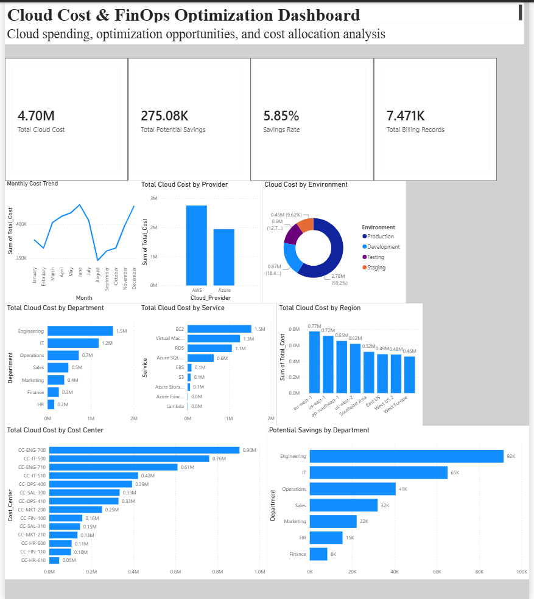

# Cloud Cost & FinOps Optimization Dashboard

## Project Overview

An interactive Power BI dashboard designed to analyze cloud spending, identify major cost drivers, and uncover potential cloud cost optimization opportunities across AWS and Azure.

## Dashboard Preview

## Tools & Technologies

- Power BI
- DAX
- Excel
- Cloud Cost Analytics
- FinOps
- Data Visualization

## Key Metrics

| Metric | Value |
|---|---:|
| Total Cloud Cost | $4.70M |
| Total Potential Savings | $275.08K |
| Savings Rate | 5.85% |
| Billing Records | 7,471 |

## Analysis Performed

The dashboard analyzes cloud expenditure across:

- Cloud Provider
- Department
- Cloud Service
- Environment
- Region
- Cost Center
- Monthly spending trends

Interactive visuals allow users to identify high-cost areas and evaluate potential optimization opportunities.

## Key Findings

- **AWS** represents the larger share of cloud spending at approximately **$2.7M**, compared with approximately **$1.9M for Azure**.
- **Engineering** is the highest-spending department at approximately **$1.5M**.
- **EC2** is the highest-cost cloud service at approximately **$1.5M**.
- **Engineering** has the largest potential savings opportunity at approximately **$91.5K**.
- The dashboard identifies approximately **$275.08K in total potential savings**, representing a **5.85% potential savings rate**.

## FinOps Recommendations

- Prioritize EC2 workloads for rightsizing and utilization analysis.
- Investigate Engineering workloads due to their high cloud spending and savings potential.
- Review AWS workloads for additional optimization opportunities.
- Use department, service, environment, region, and cost-center analysis to support ongoing cloud cost governance.

## Project Files

- `Cloud Cost FinOps Optimization Dashboard.pbix` — Power BI dashboard
- `dashboard.png` — Dashboard preview
